# Screenshots Documentation

This directory contains visual documentation of the Kubernetes microservices deployment process on Red Hat OpenShift Developer Sandbox.

## Deployment Timeline

### 01-frontend-v1.png
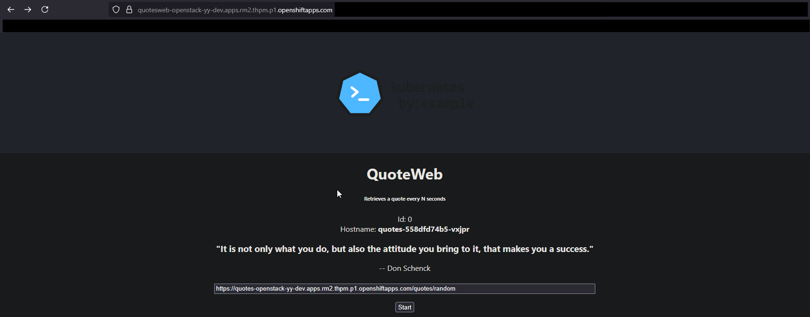

**Initial Frontend Deployment (Backend v1)**

Shows the Quote of the Day web application in its first iteration. At this stage:
- Frontend (React) is deployed and accessible via HTTPS Route
- Backend v1 returns hardcoded quotes (no database connection yet)
- Each refresh shows a random quote from the backend's in-memory array
- The hostname displayed proves the backend pod is responding

**Key Concepts**: Deployment, Service, Route with TLS termination

---

### 02-openshift-dashboard.png
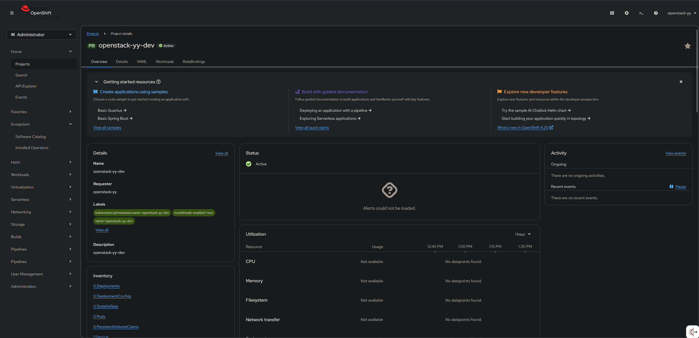

**OpenShift Developer Console Overview**

The OpenShift web console showing the project topology view:
- Visual representation of all deployed resources (Deployments, Services, Routes)
- Color-coded status indicators (blue = running, red = error)
- Topology view shows relationships between frontend, backend, and database
- Resource counts and health status at a glance

**Key Concepts**: OpenShift Developer Console, Topology View, Resource Management

---

### 03-api-token.png
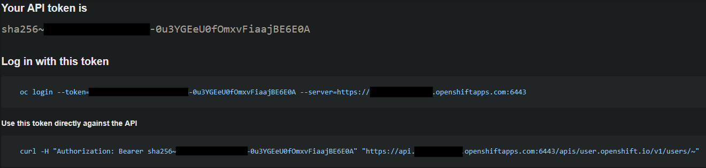

**API Authentication Token Page**

The page where developers obtain their authentication token:
- Used to login via CLI: `oc login --token=sha256~xxx --server=https://...`
- Token provides secure access to the OpenShift cluster
- Required for both `oc` and `kubectl` commands
- Tokens expire after a certain period for security

**Key Concepts**: Authentication, API Access, CLI Configuration

---

### 04-quotes-deployment.png
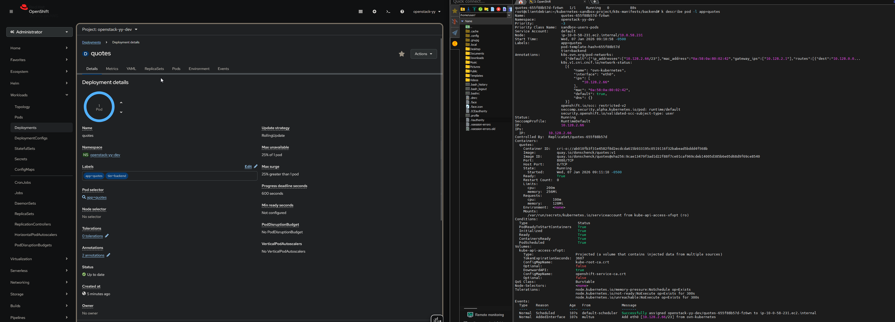

**Backend Deployment Details**

OpenShift console view of the `quotes` Deployment resource showing:
- Container image: `quay.io/donschenck/quotes:v1` (or v2 after update)
- Pod status and replica count
- Environment variables (including `DB_SERVICE_NAME=mysql`)
- Resource limits and requests
- Deployment events and rolling update history

**Key Concepts**: Deployment configuration, Container images, Environment variables

---

### 05-database-setup.png
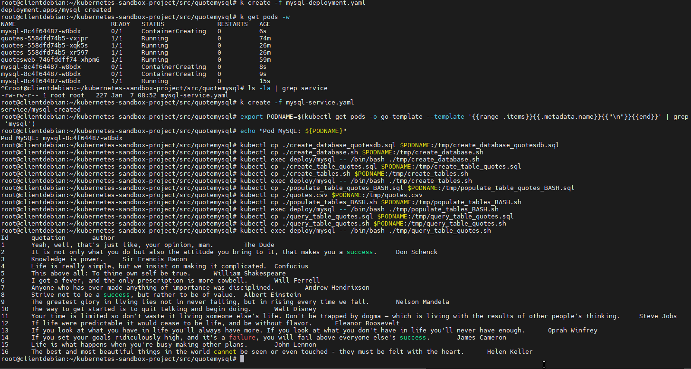

**Database Creation and Initialization**

Terminal output showing the database setup process:
- MariaDB pod deployment and readiness checks
- Database creation: `CREATE DATABASE quotesdb;`
- Table creation: `CREATE TABLE quotes (id, text, author, ...);`
- Data population from CSV file using SQL scripts
- Verification queries showing quotes successfully loaded

**Key Concepts**: Database initialization, kubectl exec, SQL operations, PersistentVolumeClaim

---

### 06-secrets.png
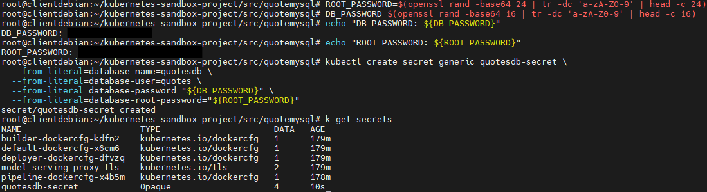

**Kubernetes Secrets Management**

OpenShift console showing the `mysqlpassword` Secret resource:
- Base64-encoded credentials storage
- Secret is referenced by both database and backend Deployments
- Environment variables injected from secretKeyRef
- Secrets are not visible in plaintext in the UI (security feature)

**Key Concepts**: Secrets, Secure credential storage, Environment variable injection

---

### 07-frontend-manifests.png
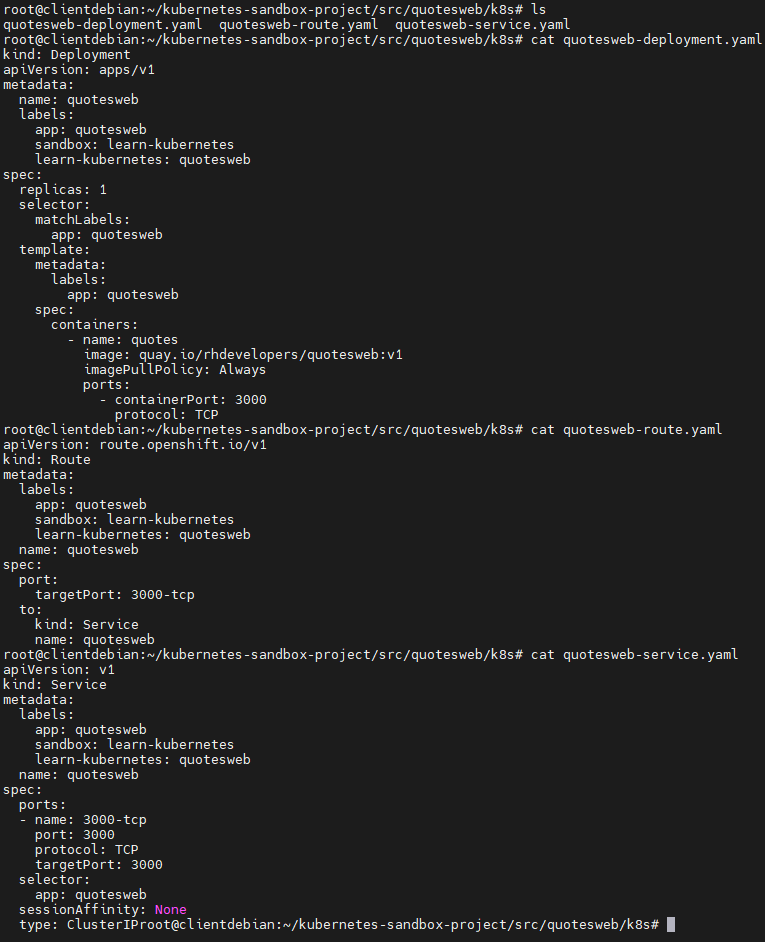

**Frontend YAML Manifests**

Code editor or terminal showing the frontend Kubernetes manifests:
- `quotesweb-deployment.yaml`: Deployment configuration
- `quotesweb-service.yaml`: ClusterIP Service on port 3000
- `quotesweb-route.yaml`: HTTPS Route with TLS edge termination
- Proper indentation and structure of YAML files

**Key Concepts**: Infrastructure as Code, YAML syntax, Kubernetes manifests

---

### 08-final-pods.png
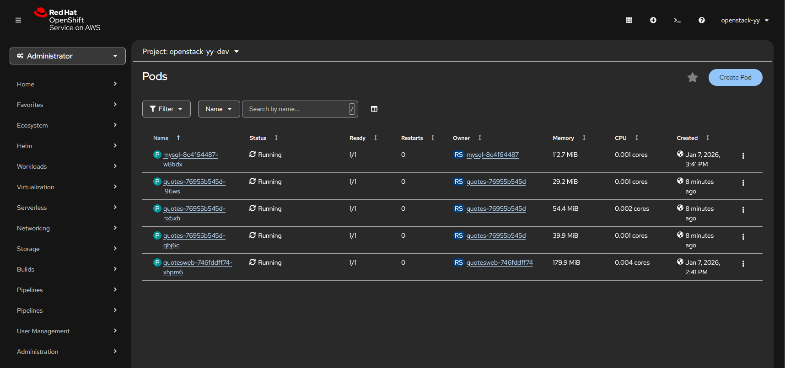

**All Pods Running Successfully**

OpenShift console pod list showing:
- `quotesweb-xxx`: Frontend pod (1/1 Running)
- `quotes-xxx-yyy`: Backend pods (multiple replicas after scaling)
- `mysql-xxx`: Database pod (1/1 Running)
- All pods in "Running" state with green checkmarks
- Pod names, status, restarts, age, and IP addresses

**Key Concepts**: Pod lifecycle, Self-healing, Multi-replica deployments

---

### 09-pods-running.png
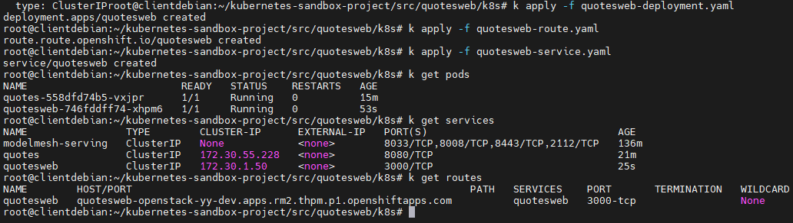

**Terminal View of Running Pods**

Command-line output from `kubectl get pods` showing:
```
NAME                        READY   STATUS    RESTARTS   AGE
mysql-xxx                   1/1     Running   0          15m
quotes-xxx-aaa              1/1     Running   0          12m
quotes-xxx-bbb              1/1     Running   0          5m
quotes-xxx-ccc              1/1     Running   0          5m
quotesweb-xxx               1/1     Running   0          10m
```

Demonstrates:
- All pods are ready (1/1)
- Multiple backend replicas after scaling
- No restarts (healthy pods)
- Different ages showing rolling updates and scaling operations

**Key Concepts**: kubectl CLI, Pod status, Horizontal scaling

---

### 10-scaling.png
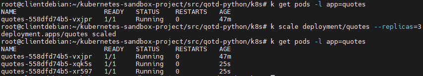

**Horizontal Pod Scaling Demonstration**

Shows the result of scaling the backend deployment:
- Command executed: `kubectl scale deployment/quotes --replicas=3`
- Three backend pods running simultaneously
- Load balancing demonstration: Multiple hostnames appear when refreshing
- Proves Kubernetes distributes traffic across all replicas

**Key Concepts**: Horizontal scaling, Load balancing, High availability

---

### 11-frontend-v2-database.png
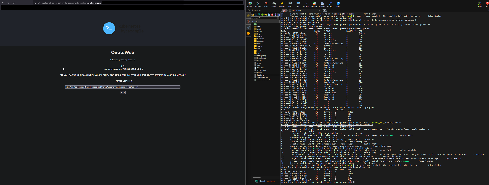

**Final Application with Database Integration (Backend v2)**

The Quote of the Day application after rolling update to backend v2:
- Backend now connected to MariaDB database
- Quotes retrieved from `quotesdb.quotes` table (not hardcoded)
- Much larger dataset available (hundreds of quotes vs ~10 hardcoded)
- Hostname still displayed showing which backend pod responded
- Data persists across pod restarts thanks to PersistentVolume

**Key Concepts**: Rolling updates, Database connectivity, Persistent storage, Zero-downtime deployment

---

## Security Note

**IMPORTANT**: Before committing screenshots, always verify they do NOT contain:
- API tokens or authentication credentials
- Database passwords or connection strings
- Personal identifiable information (PII)
- Internal IP addresses (if sensitive)
- Organization-specific URLs or identifiers

Use image editing tools to blur or redact sensitive information if necessary.

---

## Related Documentation

- [Main README](../README.md): Full deployment tutorial
- [Troubleshooting Guide](../docs/TROUBLESHOOTING.md): Common issues and solutions
- [Kubernetes Manifests](../k8s-manifests/): YAML configuration files
